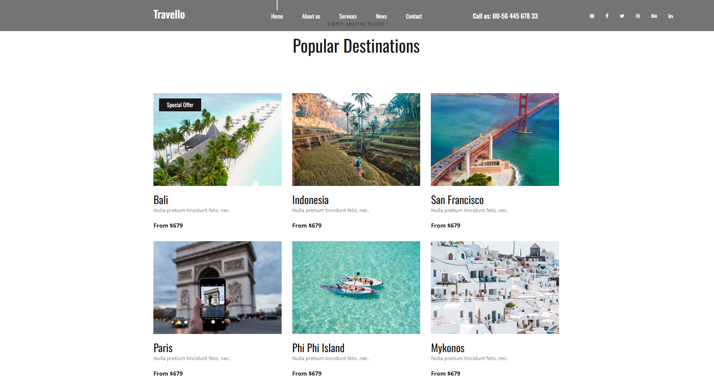

# 🌍 Travello – Travel Booking Web Application

Travello is a dynamic travel destination web application built with Django.
It transforms a static HTML template into a fully functional, database-driven platform where administrators can manage travel destinations and users can securely register and log in.

---

## 🚀 Project Overview

Travello allows:

* Admins to add, edit, and manage travel destinations
* Users to register, login, and logout securely
* Dynamic rendering of destinations from the database
* Upload and display destination images
* Real-time content updates via Django Admin Panel

The project follows Django’s **MVT (Model–View–Template)** architecture for clean and maintainable code.

---

## 🛠 Tech Stack

### Backend

* Python
* Django

### Frontend

* HTML5
* CSS3
* JavaScript
* Django Template Language (DTL)

### Database

* SQLite (Development)
* PostgreSQL (Production-ready)

### Libraries Used

* Pillow (Image handling)
* psycopg2 (PostgreSQL adapter)

---

## ✨ Features

### 🔐 Authentication System

* User Registration
* Login & Logout
* Username & Email validation
* Session management

### 🏝 Destination Management

* Add destination name
* Description
* Price
* Special offers
* Upload images

### 📊 Admin Panel

* Manage destinations
* Manage users
* Update content in real-time

### 🖼 Static & Media Handling

* Proper configuration of static files (CSS/JS)
* Media file uploads (destination images)

### 🧠 ORM & Database

* Django ORM for database interaction
* Migrations for schema updates
* No raw SQL required

---

## 📁 Project Structure

```
travello/
│
├── travello/          # Project settings
├── accounts/          # Authentication app
├── travello_app/      # Main application
├── templates/         # HTML templates
├── static/            # CSS, JS, images
├── media/             # Uploaded images
├── manage.py
└── db.sqlite3
```

---

## ⚙️ Installation & Setup

### 1️⃣ Clone the repository

```bash
git clone https://github.com/your-username/travello.git
cd travello
```

### 2️⃣ Create virtual environment

```bash
python -m venv venv
source venv/bin/activate   # Mac/Linux
venv\Scripts\activate      # Windows
```

### 3️⃣ Install dependencies

```bash
pip install -r requirements.txt
```

If no requirements file:

```bash
pip install django pillow psycopg2
```

### 4️⃣ Run migrations

```bash
python manage.py makemigrations
python manage.py migrate
```

### 5️⃣ Create superuser

```bash
python manage.py createsuperuser
```

### 6️⃣ Run the server

```bash
python manage.py runserver
```

Open in browser:

```
http://127.0.0.1:8000/
```

Admin panel:

```
http://127.0.0.1:8000/admin/
```

---
## 📷 Screenshots
1. Home Page


## 🎯 Learning Outcomes

* Implemented Django MVT architecture
* Built authentication system
* Integrated database using ORM
* Managed static and media files
* Used Django Admin for content management
* Rendered dynamic content using template logic

---

## 📌 Future Improvements

* Booking system integration
* Payment gateway
* User profile dashboard
* Search & filtering system
* Deployment on AWS/Heroku


